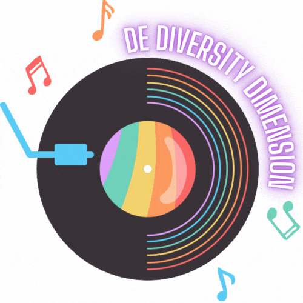

  <h1>🌟De-Diversity-Dimension🌟</h1>

  

**Introducing Diversity Dimension**: 
Empowering LGBTQ+ community with a centralized online platform. Access tailored resources, support, opportunities, and safe spaces for mental health, education, career, activism, visibility, shopping, and wellness.

Join us in **building an inclusive future**!

> "Diversity is our strength. Together, we can create a world where everyone is valued and celebrated for who they are."

 <h2>Tools and Technologies used</h2>
     

To run this locally:
- `npm install` or `yarn`
- `npm run dev` or `yarn dev`
